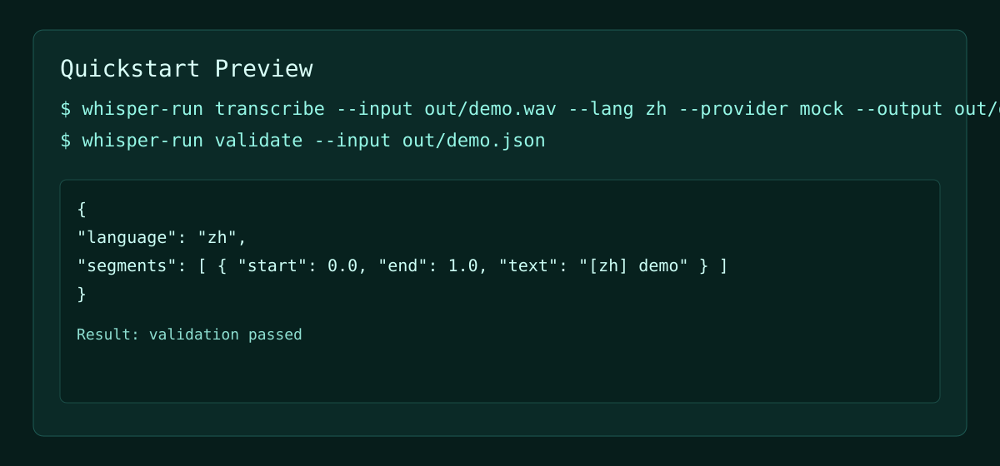

# speech-integration-starter


[](../../actions)
[](https://www.python.org/downloads/)
[](./LICENSE)

> 讓你快速完成語音轉寫接入與標準化輸出。  
> **重點是快速引用與可重現。**

---

## 一分鐘看懂價值

- 統一轉寫輸出格式（`language + segments`）
- Provider 可替換，整合成本低
- CPU-only CI 也能完整驗證流程



---

## 30 秒快速引用

```bash
python -m venv .venv
. .venv/bin/activate  # Windows: .venv\Scripts\activate
pip install -e .[dev]
python scripts/generate_demo_wav.py
whisper-run transcribe --input ./out/demo.wav --lang zh --provider mock --output ./out/demo.json
whisper-run validate --input ./out/demo.json
```

---

## 你可以直接用在

- 語音轉文字原型驗證
- 會議內容前處理
- 多 provider 接入的基線層

---

## 輸入 / 輸出示例

```text
input:  out/demo.wav
output: out/demo.json
```

```json
{
  "language": "zh",
  "segments": [
    { "start": 0.0, "end": 1.0, "text": "[zh] demo" }
  ]
}
```

---

## Python API

```python
from whisper_starter.pipeline import transcribe_file
from whisper_starter.providers.mock_provider import MockProvider

result = transcribe_file(
    audio_path="out/demo.wav",
    language="zh",
    provider=MockProvider(),
)
print(result)
```

---

## 安全邊界

本 repo 不包含真實語料、業務決策規則與內部流程細節。  
詳見 `docs/threat-model.md`。

---

## 開發與測試

```bash
python scripts/keyword_guard.py
pytest -q
```

---

## 授權

MIT License，詳見 `LICENSE`。
